# MANUAL DE USUARIO - PresuControl V5

Aplicacion web de control de presupuestos para empresas y equipos de gestion.

---

## 1. INTRODUCCION

### 1.1 Que es PresuControl

PresuControl V5 es una aplicacion web disenada para centralizar y controlar todos los presupuestos de una organizacion. Permite hacer seguimiento desde que se recibe un presupuesto hasta su cierre final, incluyendo la gestion de pedidos a proveedor cuando un presupuesto aceptado genera necesidades de compra.

La plataforma esta construida como una aplicacion SPA (Single Page Application) con un backend separado, lo que garantiza rendimiento y escalabilidad. Los datos se presentan en tiempo real y se almacenan de forma segura en una base de datos interna.

### 1.2 Para que sirve

El sistema esta pensado para resolver tres necesidades concretas:

**Control de presupuestos aceptados.** Cada presupuesto entra en el sistema con un estado, un gestor responsable y una prioridad. A medida que avanza su ciclo de vida, se actualiza su estado hasta que se marca como cerrado o archivado.

**Gestion de pedidos a proveedor.** Cuando un presupuesto aceptado requiere materiales o servicios externos, el sistema permite registrar pedidos a proveedor vinculados, conocer su estado y vincular los costes al presupuesto original.

**Visibilidad y alertas.** El sistema monitoriza riesgos, fechas limite y excepciones, enviando alertas automaticas cuando un presupuesto requiere atencion. Los gestores y administradores tienen dashboards personalizados con los indicadores clave.

### 1.3 Roles de usuario

El sistema define dos roles principales que determinan que funcionalidades estan disponibles para cada persona.

**Administrador.** Tiene acceso completo a todas las secciones: gestion de usuarios, configuracion del sistema, logs de auditoria, importacion masiva, reportes avanzados y todas las vistas de presupuestos. Es el unico que puede aprobar registros nuevos y modificar la configuracion global.

**Gestor.** Accede a una vista personalizada de su propio trabajo. Puede crear, editar y avanzar sus presupuestos, asi como gestionar los pedidos a proveedor asociados. No ve los presupuestos de otros gestores a menos que se le asignen explicitamente.

### 1.4 Requisitos de acceso

Para acceder a PresuControl necesitas un navegador moderno (Chrome, Firefox, Edge o Safari) y conexion a la URL del servidor. En entorno local la direccion es `http://localhost:8088`. En produccion, tu administrador te indicara el dominio correspondiente.

---

## 2. ACCESO AL SISTEMA

### 2.1 Pantalla de login

Al acceder a la URL del sistema veras la pantalla de inicio de sesion. Esta pagina solicita dos campos: tu identificador de usuario (normalmente tu email) y tu contrasena. El formulario es directo y no requiere navegacion adicional.

Si aun no tienes cuenta veras un enlace titled "Registrarse" o "Crear cuenta" debajo del formulario. Utiliza ese enlace para solicitar el alta.

**Consejo:** Si olvidas tu contrasena, contacta con tu administrador. El sistema no incluye recuperacion self-service por defecto, pero tu administrador puede realizar un reset desde el panel de gestion de usuarios.

### 2.2 Registro de nuevo usuario

Al seleccionar la opcion de registro se abre un formulario donde debes completar tus datos basicos: nombre, email y una contrasena provisional. Tambien podrian pedirse datos adicionales como tu area, departamento o telefono.

Una vez enviado el formulario, el sistema no te activa automaticamente. Tu cuenta queda en estado "pendiente" hasta que un administrador la revisa y aprueba. Recibiras un mensaje indicando que tu solicitud esta en espera.

**Nota:** Este flujo de aprobacion existe para que solo personas autorizadas puedan acceder a los datos de la organizacion. Si necesitas que te den de alta rapidamente, contacta directamente con tu administrador.

### 2.3 Aprobacion de usuarios (admin)

Los administradores ven las solicitudes pendientes desde el panel de gestion de usuarios, donde aparecen listadas con su informacion basica. Desde ahi el administrador puede aprobar o rechazar cada solicitud.

Al aprobar, el usuario recibe un email con las instrucciones para activar su cuenta y establecer su contrasena definitiva. Al rechazar, normalmente se pide una causa, y el usuario rechazado recibira una notificacion.

---

## 3. INTERFAZ GENERAL

### 3.1 Barra superior

La barra superior es el elemento de navegacion principal y esta presente en todas las pantallas de la aplicacion despues de iniciar sesion. A la izquierda encontraras el logotipo o nombre de la aplicacion. A la derecha hay tres areas:

El campo de busqueda permite buscar cualquier presupuesto por su identificador, nombre de cliente, concepto o cualquier texto que aparezca en los comentarios. Al escribir se muestran sugerencias en tiempo real.

Las notificaciones aparecen como un icono con un punto indicador cuando hay elementos nuevos. Al hacer clic se despliega un panel con las ultimas alertas y avisos del sistema. Desde alli puedes marcar elementos como leidos o acceder directamente al elemento relacionado.

El menu de usuario se encuentra en la esquina superior derecha. Muestra tu nombre y avatar. Al hacer clic accedes a tu perfil, preferencias y la opcion de cerrar sesion.

### 3.2 Menu lateral

El menu lateral aparece en el lado izquierdo de la pantalla y contiene los accesos a todas las secciones principales. Para el administrador incluye: Dashboard, Presupuestos, Kanban, Usuarios, Configuracion, Logs, Importar, Reportes, Calendario, Buscar, Mi Mesa, Notificaciones y Avisos.

Para el gestor el menu lateral esta filtrado y muestra solo las opciones relevantes: Mi Trabajo, Mis Presupuestos, Kanban y Notificaciones. Esto reduce el ruido visual y facilita la navegacion.

Cada elemento del menu lleva asociado un icono representativo. Los elementos que tienen subsecciones o tablas adicionales se agrupan visualmente. Los contadores que aparecen junto a algunos elementos (como "Mis Presupuestos (12)") indican el numero de elementos pendientes de atencion.

### 3.3 Navegacion movil

La aplicacion es responsive y se adapta a pantallas pequenas. En dispositivos moviles, el menu lateral se oculta detras de un boton hamburguesa que aparece en la barra superior. Al pulsar sobre el se despliega el menu en forma de panel lateral que ocupa toda o parte de la pantalla.

Los formularios, tablas y vistas kanban se reorganizan para aprovechar el espacio vertical de la pantalla. Los graficos se redimensionan o se muestran en version compacta cuando es necesario.

---

## 4. MANUAL DE ADMINISTRADOR

### 4.1 Dashboard

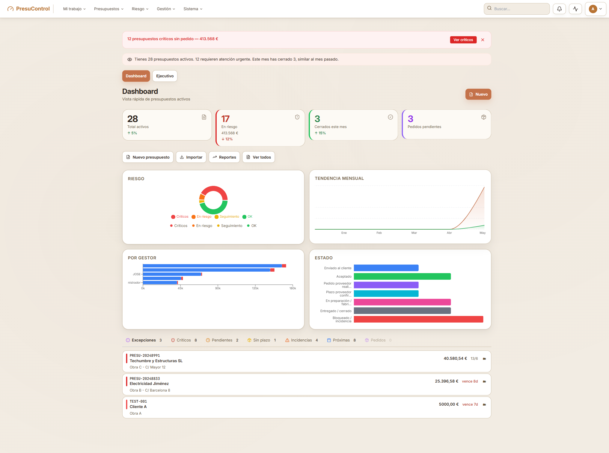

El dashboard es la pantalla principal que ve el administrador al iniciar sesion. Esta disenado para dar una vision rapida del estado general de todos los presupuestos y permitir actuar sobre las excepciones mas urgentes.

**KPIs superiores.** La primera fila muestra cuatro indicadores clave en tarjetas independientes: el total de presupuestos activos, el numero de presupuestos en riesgo, la cantidad de presupuestos cerrados y los pedidos pendientes de proveedor. Cada tarjeta muestra el numero en grande y un indicador visual de color (verde, amarillo, rojo) segun el umbral configurado.

**Graficos de analisis.** Debajo de los KPIs hay cuatro graficos dispuestos en cuadrante. El grafico de riesgo muestra la distribucion de presupuestos por nivel de riesgo. El grafico de tendencia presenta la evolucion temporal de presupuestos nuevos frente a cerrados. El grafico por gestor muestra el volumen de cada gestor. El grafico de estado presenta la proporcionalidad por estado actual.

**Sistema de tabs.** Bajo los graficos hay una barra de tabs que permite filtrar vistas especificas: Excepciones (presupuestos fuera de los parametros normales), Criticos (con incidencias abiertas), Pendientes (que requieren accion), Todos. Cada tab actualiza el contenido de la zona inferior y muestra una lista filtrada de presupuestos relevantes.

**Banner de alertas criticas.** Cuando existen presupuestos criticos, un banner de color llamativo aparece en la parte superior del dashboard con un mensaje de advertencia y un enlace directo a la lista de criticos. Este banner no se puede ignorar visualmente y ayuda a priorizar la atencion.

**Como usarlo.** Entra al dashboard cada manana para revisar el estado general. Presta atencion especial al banner de criticos. Si necesitas profundizar en un gestor o estado especifico, haz clic en el grafico correspondiente para filtrar la lista inferior.

**Consejo:** Configura los umbrales de riesgo en Configuracion para que los KPIs reflejen fielmente los criterios de tu organizacion. Si el numero de criticos es siempre alto, puede que los umbrales estén demasiado bajos.

### 4.2 Gestion de Presupuestos

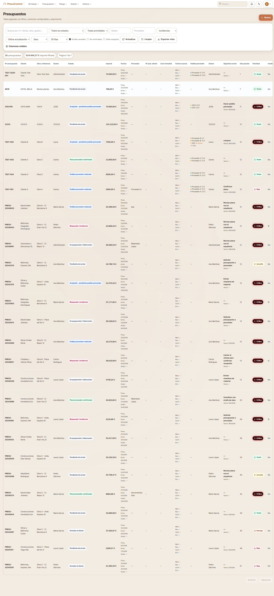

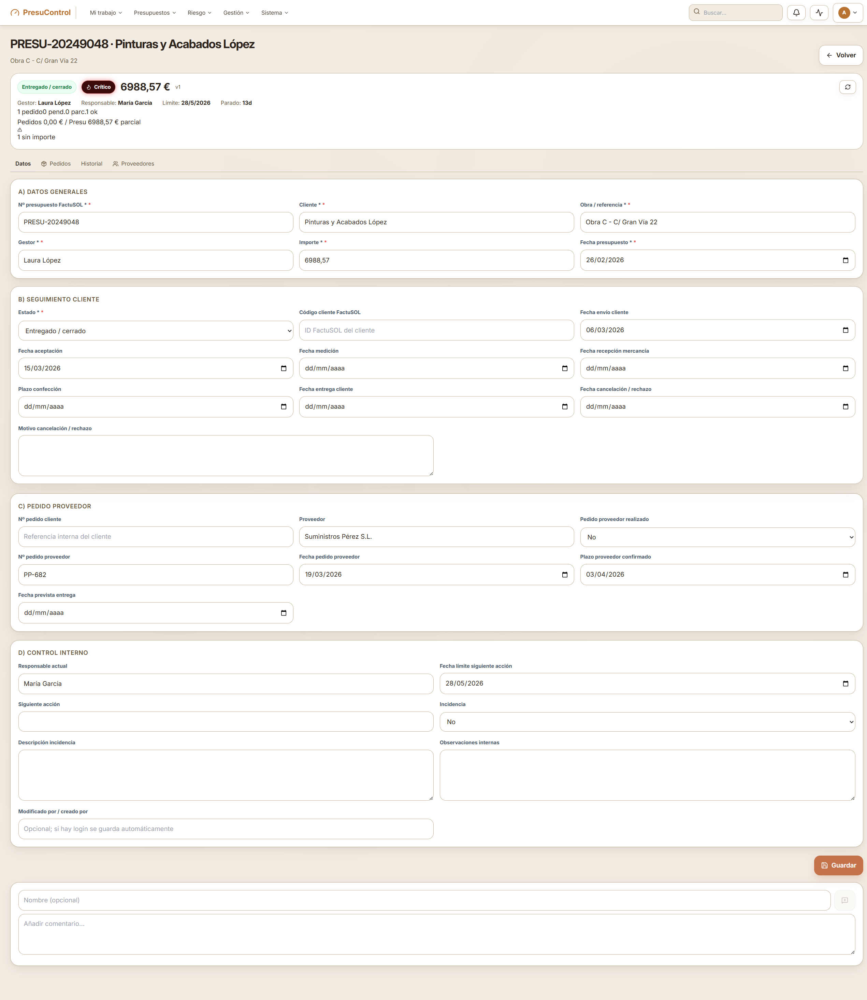

La seccion de presupuestos es el nucleo de la aplicacion. Desde aqui se accede a la lista completa de todos los presupuestos del sistema, se crean nuevos registros y se editan los existentes.

**Vista de lista.** La pantalla principal muestra una tabla con los presupuestos. Cada fila representa un presupuesto y las columnas muestran informacion clave: ID interno, nombre del cliente, estado actual, prioridad, gestor asignado, importe total, fecha de creacion y fecha limite. La tabla es ordenable por cualquier columna haciendo clic en su encabezado.

**Filtros.** Encima de la tabla hay una barra de filtros que permite reducir la lista. Los filtros disponibles incluyen: estado del presupuesto (aceptado, cerrado, en curso...), prioridad (alta, media, baja), gestor asignado, y un campo de busqueda libre que filtra por texto en cualquier campo. Los filtros se aplican en tiempo real sin necesidad de pulsar un boton. Hay un boton para limpiar filtros y volver a la vista completa.

**Crear presupuesto nuevo.** El boton principal "Nuevo Presupuesto" (o similar) se encuentra en la zona superior derecha de la pantalla. Al pulsarlo se abre un formulario modal o una pagina dedicada donde debes completar los datos del presupuesto. Los campos obligatorios suelen incluir: nombre del cliente, concepto, estado inicial, prioridad, importe estimado y gestor responsable. Al guardar se crea el registro y aparece en la lista.

**Editar presupuesto existente.** Cada fila de la tabla tiene acciones en la columna derecha: un icono de lapiz para editar y un icono de ojo para ver detalles. Tambien puedes hacer doble clic en una fila para abrir la edicion directamente. El formulario de edicion es similar al de alta pero con los campos precumplados. Al guardar se registran los cambios en el historial.

**Detalle de presupuesto.** Al pulsar sobre el icono de ver detalles accedes a la ficha completa del presupuesto. Esta pantalla agrupa toda la informacion en secciones: datos generales, documentos adjuntos, comentarios, historial de cambios y pedidos a proveedor asociados.

**Comentarios e historial.** Dentro del detalle hay una seccion de comentarios donde cualquier usuario con acceso puede deixar notas. Cada comentario registra el autor y la fecha. La seccion de historial muestra un log cronologico de todos los cambios realizados sobre ese presupuesto, incluyendo quien hizo cada cambio y cuando.

**Pedidos a proveedor.** Si el presupuesto ha generado pedidos a proveedor, estos aparecen en una seccion dedicada dentro del detalle. Cada pedido muestra su estado, importe, proveedor y fecha. Es posible crear nuevos pedidos desde aqui y vincularlos al presupuesto.

**Archivado.** Los presupuestos que ya no estan activos pueden archivarse. El archivo los oculta de las listas principales pero los mantiene disponibles para consulta. Esta accion se realiza desde el menu de acciones del presupuesto o desde su detalle.

### 4.3 Kanban

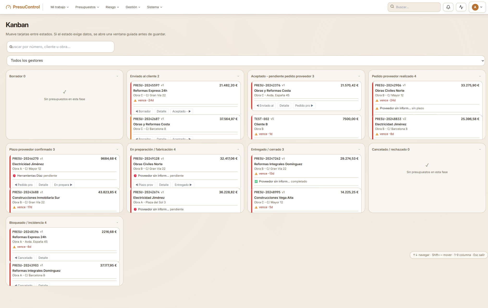

La vista Kanban ofrece una representacion visual del flujo de trabajo de los presupuestos. Las columnas representan los estados posibles (por ejemplo: Recibido, En revision, Aceptado, Rechazado, Cerrado) y las tarjetas representan presupuestos individuales.

**Estructura de columnas.** Cada columna tiene un titulo con el nombre del estado y un contador que indica quantos presupuestos hay en ese estado. Las columnas se renderizan en scroll horizontal si no caben en pantalla.

**Tarjetas de presupuesto.** Cada tarjeta muestra informacion resumida: el nombre del cliente, la prioridad del presupuesto (con un indicador de color), el importe y el nombre del gestor. Algunas tarjetas pueden mostrar badges adicionales como "Pendiente datos" o "En riesgo".

**Arrastrar entre estados.** Puedes arrastrar cualquier tarjeta de una columna a otra para actualizar su estado. Al soltar en una nueva columna se abre un modal donde el sistema solicita los datos obligatorios para esa transicion. Por ejemplo, al mover un presupuesto a "Aceptado" puede pedirte que confirmes el importe final y la fecha de aceptacion.

**Acciones rapidas.** Sobre cada tarjeta hay botones de accion rapida que aparecen al pasar el raton: editar, ver detalles o marcar como critico. Estas acciones permiten intervenir sin necesidad de abrir la ficha completa.

**Como usarlo.** La vista Kanban es ideal para reuniones de seguimiento donde se revisa el estado de cada presupuesto de forma visual. Arrastra las tarjetas segun evolucionan y completa los datos que el modal pida en cada transicion. Asi el historial queda automaticamente registrado.

### 4.4 Gestion de Usuarios

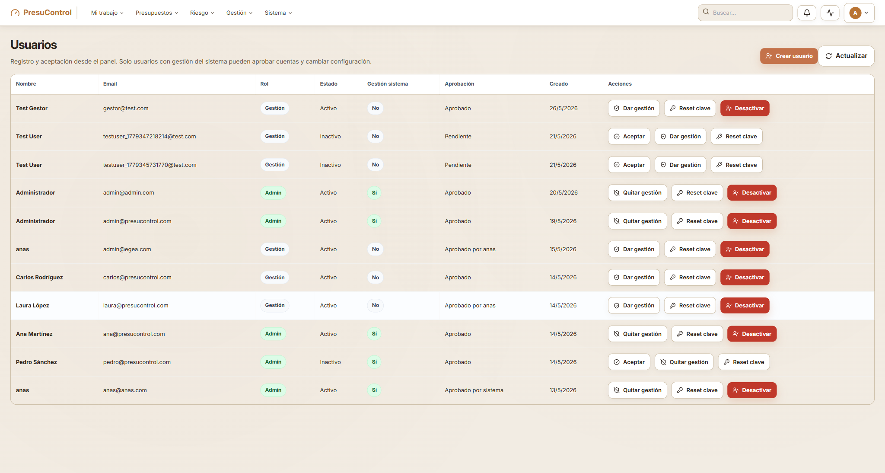

Desde esta seccion el administrador controla todas las cuentas de usuario del sistema, incluyendo altas, bajas, permisos y contrasenas.

**Lista de usuarios.** La pantalla muestra una tabla con todos los usuarios registrados: nombre, email, rol (Admin o Gestor), estado (activo, pendiente, desactivado) y fecha de ultimo acceso. La tabla es ordenable y filtrable.

**Aprobar o rechazar nuevos registros.** Cuando un usuario se registra y su cuenta esta pendiente, aparece en esta lista con el estado "Pendiente". El administrador tiene dos acciones: un boton verde para aprobar y uno rojo para rechazar. Al aprobar se envia un email al usuario con las instrucciones. Al rechazar se pide un motivo.

**Activar y desactivar.** Los usuarios activos pueden desactivarse temporalmente sin eliminar su cuenta. Un usuario desactivado no puede iniciar sesion pero sus datos y el historial de sus acciones se mantienen intactos. Para reactivar, se usa el mismo proceso en sentido inverso.

**Permisos de gestion del sistema.** Dentro de la edicion de cada usuario puedes modificar su rol. Un Gestor con permisos de sistema adicionales puede ver mas datos o realizar acciones que normalmente serian solo para administradores. Este ajuste se hace con cuidado y segun necesidad.

**Reset de contrasena.** El administrador puede solicitar un reset de contrasena para cualquier usuario. El sistema enviara un enlace de recuperacion al email del usuario o generara una contrasena temporal.

### 4.5 Configuracion del Sistema

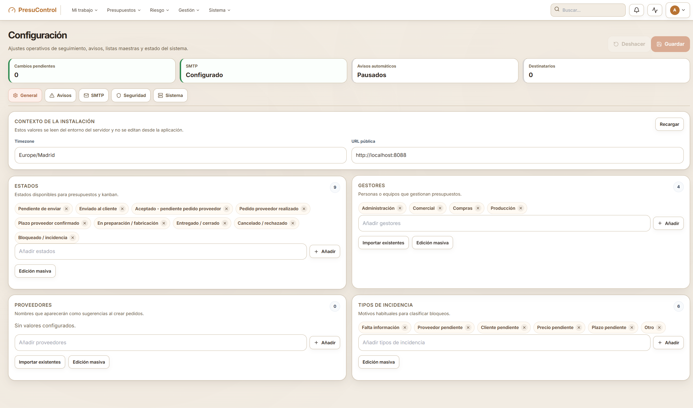

Esta seccion permite personalizar el comportamiento global de PresuControl. Los cambios aqui afectan a todos los usuarios.

**Estados de presupuesto.** Define los estados posibles que pueden tener los presupuestos. Puedes agregar nuevos estados, renombrar los existentes, cambiar su orden en el flujo o desactivar los que no se usen. Mantener nombres claros y coherentes facilita el uso diario.

**Gestores y proveedores.** Gestiona las listas de gestores (usuarios internos) y proveedores (entidades externas a las que se hacen pedidos). Los gestores se asignan a presupuestos. Los proveedores se vinculan a los pedidos a proveedor. Ambos campos pueden editarse desde aqui para mantener los catalogos actualizados.

**Configuracion de email (SMTP).** Para que el sistema pueda enviar notificaciones y emails de recuperacion, debes configurar los datos del servidor SMTP: direccion del servidor, puerto, usuario, contrasena y si usa TLS/SSL. Guarda la configuracion y prueba el envio con el boton de prueba.

**Umbrales de riesgo y avisos.** Aqui defines los parametros que determinan cuando un presupuesto se considera "en riesgo". Puedes configurar importes minimos, dias de retraso tolerable y cualquier otra metrica que el sistema use para calcular el indicador de riesgo. Tambien se configuran los umbrales para los banners de alerta critica.

**Programacion de alertas automaticas.** El sistema puede enviar recordatorios automaticos segun se programen. Por ejemplo: alerta 7 dias antes de una fecha limite, o notificacion al gestor si su presupuesto lleva mas de X dias sin actualizarse. Desde este apartado programas esas reglas, defines su frecuencia y seleccionas que tipo de alertas generar.

### 4.6 Logs y Auditoria

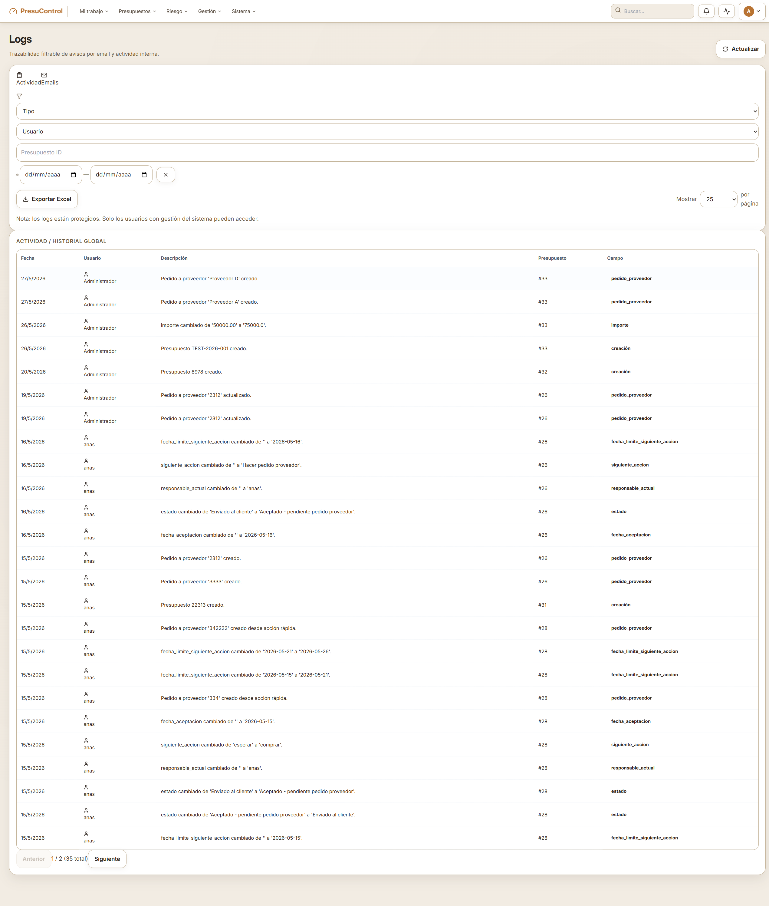

Esta seccion es un registro completo de la actividad del sistema. Resulta util para auditorias, resolver problemas y rastrear quien hizo quoi.

**Logs de actividad.** Cada accion relevante en el sistema genera un registro: creacion de presupuestos, cambios de estado, ediciones, archivos, envios de email. Los logs incluyen: fecha y hora, usuario que realizo la accion, tipo de accion, presupuesto afectado (si aplica) y detalles adicionales.

**Logs de emails.** El sistema registra cada email que se envia automaticamente: a quien, con que asunto, cuerpo y si el envio fue exitoso. Esto permite verificar que las notificaciones llegaron corretamente.

**Filtros y busqueda.** Los logs pueden filtrarse por tipo (actividad, email), usuario especifico, presupuesto, rango de fechas o palabras clave. Los filtros se combinan para permitir busquedas muy especificas.

**Exportacion Excel.** Para auditorias formales o reportes, puedes exportar los logs filtrados a un archivo Excel. El archivo contiene todas las columnas visibles en la tabla mas informacion adicional que pueda ser util.

### 4.7 Importacion Excel/CSV

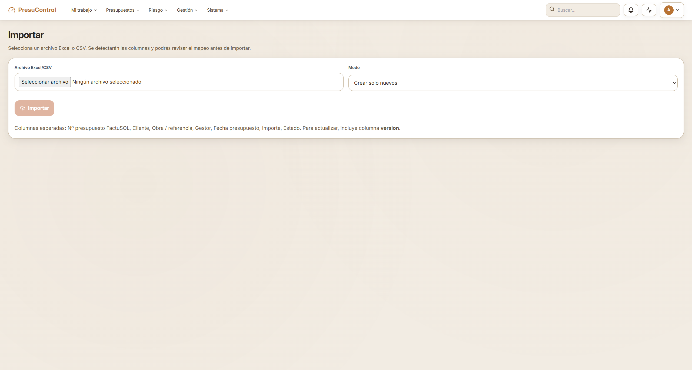

Esta funcionalidad permite cargar grandes cantidades de presupuestos desde un archivo Excel o CSV, sin necesidad de crearlos uno por uno manualmente.

**Subir archivo.** El interfaz presenta un area de carga donde arrastras tu archivo o haces clic para seleccionarlo. Formatos aceptados: .xlsx, .xls, .csv. Al seleccionar se inicia la carga automatica.

**Vista previa.** Una vez cargado, el sistema muestra una vista previa con las primeras filas del archivo. Esto permite verificar que las columnas se han interpretado corretamente antes de confirmar la importacion.

**Mapeo de columnas.** Puede que los nombres de columna en tu archivo no coincidan exactamente con los del sistema. El interfaz permite mapear cada columna de tu archivo al campo correspondiente del sistema. Este mapeo se guarda para futuras importaciones.

**Modo de importacion.** Antes de importar debes elegir el modo: "Crear nuevos" (solo registra presupuestos que no existan, basados en un identificador unico) o "Actualizar existentes" (si el identificador ya existe, actualiza sus datos; si no existe, lo crea). Tambien hay opcion de combinar ambos.

**Control de concurrencia.** El archivo puede incluir una columna de version. Si el registro en base de datos tiene una version superior a la del archivo, la importacion se salta ese registro y lo marca como conflicto. Esto evita sobrescribir cambios realizados por otros usuarios simultaneamente.

### 4.8 Reportes

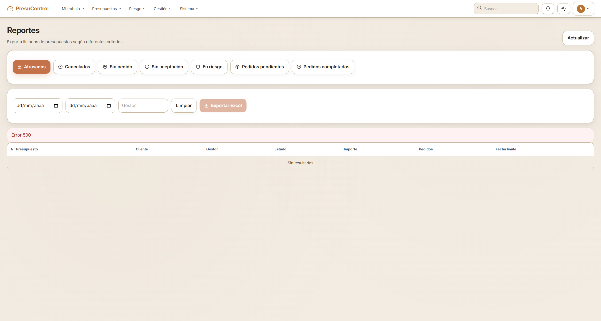

El modulo de reportes permite generar informes formales sobre diferentes aspectos de la gestion de presupuestos.

**Informes predefinidos.** El sistema incluye plantillas de informe para las consultas mas comunes. Algunos ejemplos: presupuestos atrasados (con retraso mayor a X dias), presupuestos en riesgo, resumen por gestor, resumen por estado, presupuestos cerrados en el ultimo mes. Solo debes seleccionar el informe, definir el periodo y pulsar generar.

**Exportacion Excel con graficos.** Los informes se generan en pantalla y pueden ser exportados a Excel. El archivo exportado incluye no solo los datos en tablas sino tambien graficos automaticamente generados que visualizan la informacion (barras, lineas, tartas segun el tipo de informe).

**Reportes personalizados.** Si necesitas un informe a medida, el sistema permite definir columnas, filtros y agrupacion. Selecciona los campos a mostrar, aplica filtros por estado/gestor/fecha, define niveles de agrupacion y ordena por la columna que prefieras.

### 4.9 Otras vistas

#### Calendario

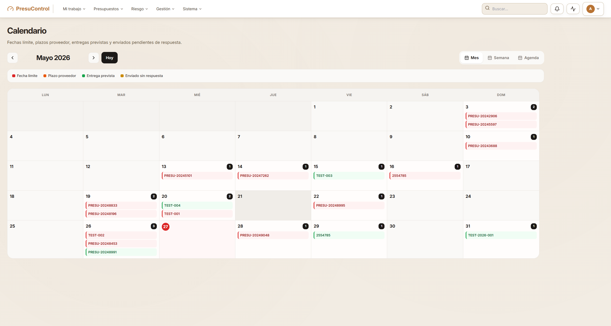

El calendario muestra las fechas limite de todos los presupuestos en una vista mensual. Cada dia con presupuestos muestra los nombres abreviados y un indicador de prioridad. Haz clic en un dia para ver los presupuestos那份 tiene y acceder directamente a su detalle.

Esta vista es util para planificar la semana y anticiparte a las fechas limite inminentes.

#### Busqueda global

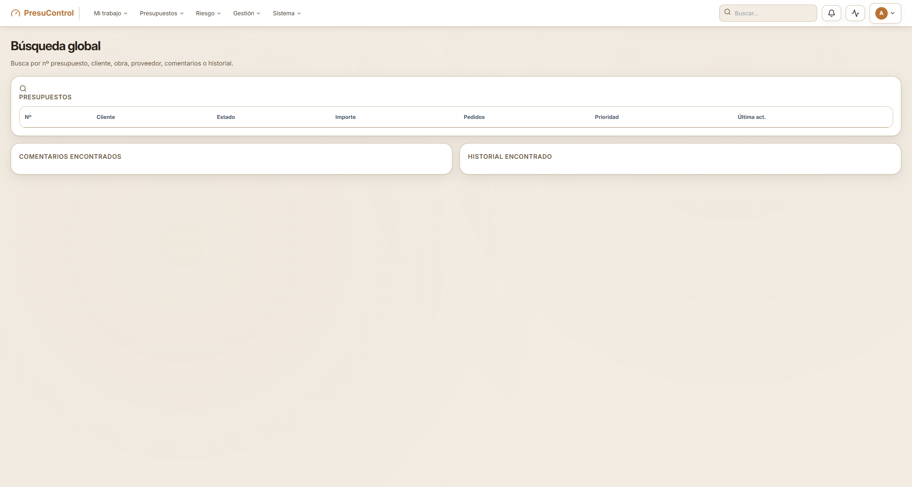

La busqueda global es una herramienta poderosa que rastrea cualquier texto en presupuestos, comentarios e historial. Funciona como un buscador: escribes una palabra y el sistema devuelve todos los registros donde aparezca: nombres de cliente, conceptos, notas en comentarios, nombres de gestores, etc.

Los resultados se agrupan por tipo (presupuestos, comentarios, historial) y puedes hacer clic en cualquier resultado para ir directamente al punto exacto donde aparece.

#### Mi Mesa

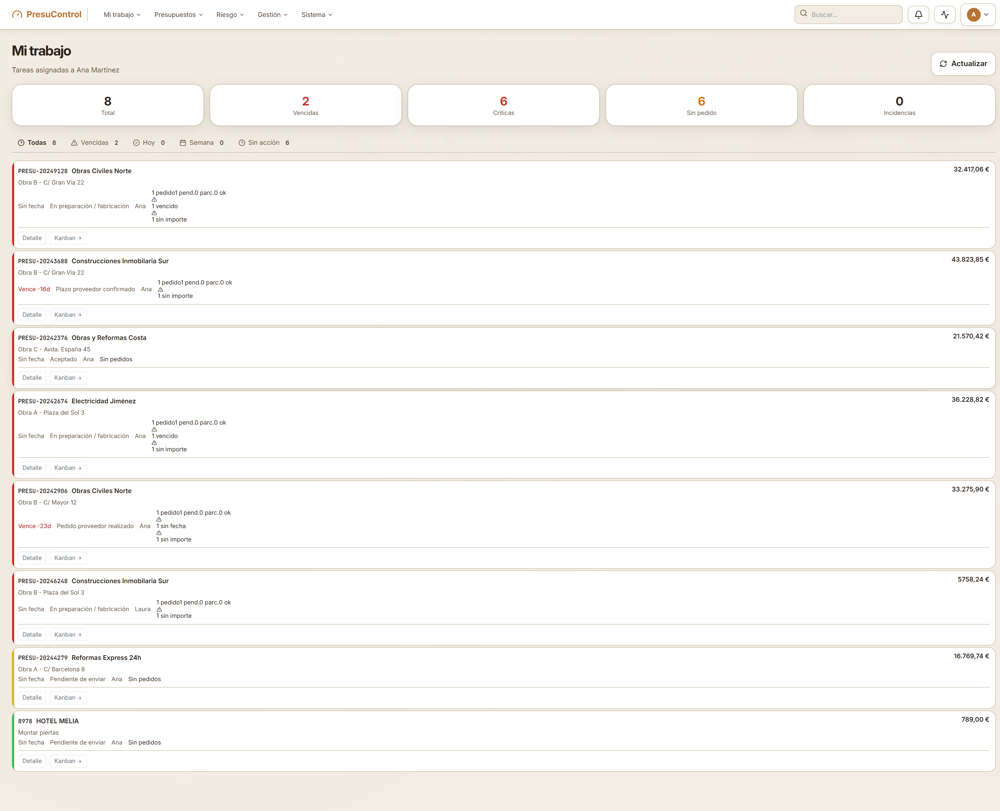

Mi Mesa es el escritorio personal del administrador. Aqui se agrupan las acciones pendientes que requieren su atencion: presupuestos pendientes de aprobacion, usuarios pendientes de activar, alertas sin resolver, tareas derivadas de incidencias.

Resulta util como punto de entrada unico para no olvidar nada importante.

#### Notificaciones

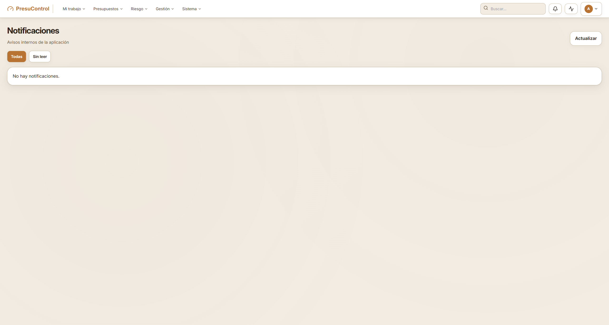

Este es el centro de notificaciones del sistema. Aqui veras todas las alertas que te han llegado: presupuestos en riesgo, cambios asignados a ti, emails recibidos, recordatorios programados.

Las notificaciones puedes marcarlas como leidas individualmente o en grupo. Algunas notificaciones permiten accion directa (por ejemplo, pulsar en una alerta de presupuesto en riesgo te lleva directamente a su detalle).

#### Avisos

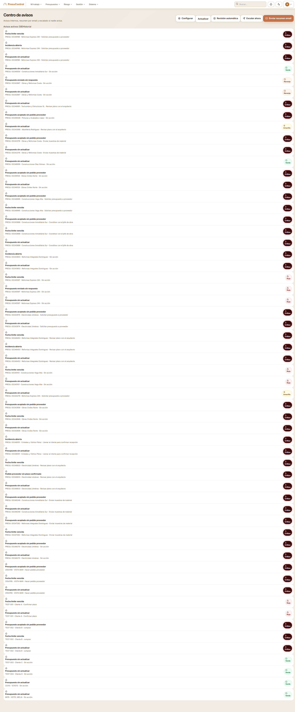

El sistema de avisos funciona como un canal de mensajes entre la administracion y los usuarios. Los avisos son mensajes que aparecen en la interfaz de forma destacada. Pueden ser avisos generales del sistema (mantenimiento programado, nuevas funcionalidades) o avisos dirigidos a usuarios especificos.

Los administradores crean y gestionan avisos desde esta seccion. Los avisos pueden tener fecha de publicacion y caducidad, de modo que se muestrensolo durante el periodo relevante.

---

## 5. MANUAL DE GESTOR

### 5.1 Mi Trabajo

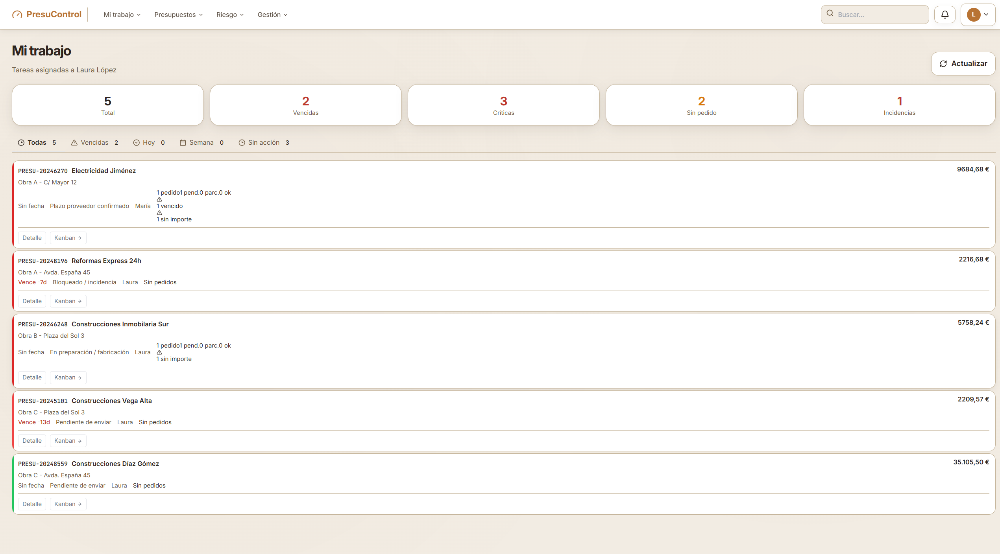

Mi Trabajo es tu pantalla de entrada como Gestor. Esta personalizada para mostrar unicamente la informacion relevante para tu actividad diaria.

**Vista personalizada.** Nada mas entrar veras una seleccion de presupuestos donde tu eres el gestor responsable. La vista prioriza los presupuestos que requieren atencion inmediata: fechas limite cercanas, presupuestos en riesgo o con incidencias abiertas.

**Proximas acciones.** En la zona superior se muestra una lista de las acciones que debes realizar proximamente. Esto puede incluir: presupuestos pendientes de actualizar su estado, pedidos a proveedor que requieren confirmacion, o comentarios que necesitan respuesta.

**Filtro por responsable y gestor.** Puedes filtrar la lista para mostrar solo los presupuestos donde eres Gestor principal o donde te han asignado como actor secundario. Esto permite distinguir entre tu carga de trabajo directa y colaboraciones.

### 5.2 Presupuestos del Gestor

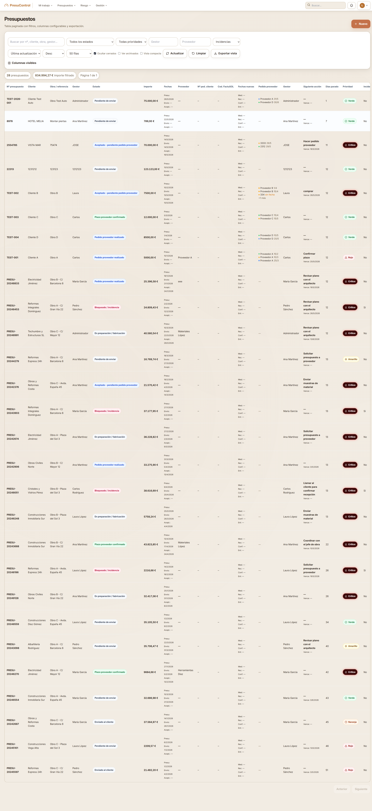

Esta seccion lista todos los presupuestos asociados a ti como gestor. A diferencia del admin, aqui solo ves tus propios presupuestos.

**Lista filtrada por gestor.** La pantalla muestra una tabla con tus presupuestos. Las columnas son similares a la lista general: ID, cliente, estado, prioridad, importe y fecha. Solo se muestran los presupuestos donde tu eres el gestor asignado.

**Crear presupuesto.** Puedes crear nuevos presupuestos directamente desde esta vista con el boton "Nuevo Presupuesto". El formulario es el mismo que usa el admin pero preasigna automaticamente tu usuario como gestor.

**Editar presupuestos.** Al pulsar sobre una fila accedes a la edicion. Puedes actualizar cualquier campo para el que tengas permisos: estado, prioridad, importe, comentarios o datos del cliente.

**Vista compacta.** Si prefieres una vista mas compacta puedes cambiar a un modo de tabla simplificada que muestra menos columnas pero mas filas simultaneamente. Esto es util cuando tienes muchos presupuestos y necesitas una vision rapida.

### 5.3 Kanban del Gestor

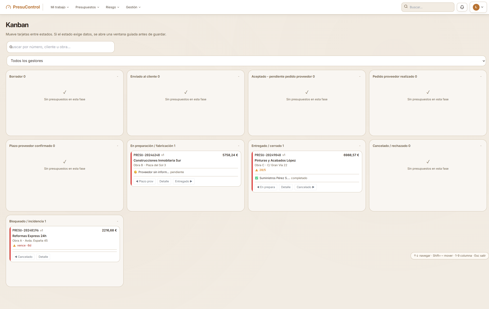

El Kanban del gestor funciona igual que el Kanban general del admin pero muestra unicamente tus presupuestos. Esto te permite visualizar tu propio flujo de trabajo sin distracciones de presupuestos de otros gestores.

**Mover presupuestos.** Arrastra tus tarjetas de una columna a otra para actualizar su estado. El sistema pedira que confirmes los datos obligatorios para cada transicion, igual que en el Kanban general.

**Completar datos al avanzar.** Cuando mueves un presupuesto a un nuevo estado, el modal que se abre solicita los datos necesarios para esa transicion. Por ejemplo, al pasar de "En revision" a "Aceptado" puede pedirte el importe finalmente aceptado y la fecha de aceptacion. Rellena estos datos con cuidado porque quedan registrados en el historial.

**Acciones rapidas.** Todas las tarjetas disponen de acciones rapidas para editar o ver detalles sin necesidad de arrastrar. Esto acelera la navegacion cuando solo necesitas consultar o hacer un cambio pequeno.

### 5.4 Detalle de Presupuesto

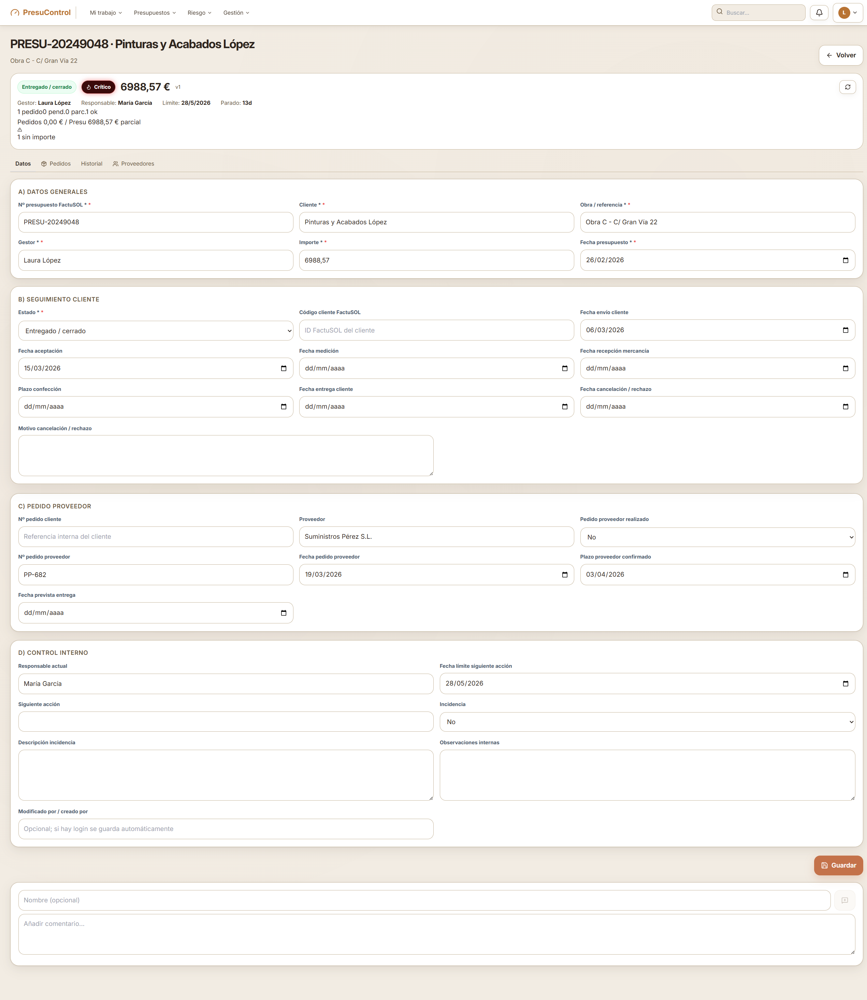

Cuando abres un presupuesto desde tu lista o desde el Kanban accedes a su ficha completa. Esta pantalla muestra toda la informacion del presupuesto de forma organizada.

**Datos generales.** La seccion superior muestra los datos principales: cliente, concepto, estado actual, prioridad, importe estimado, gestor, fechas de creacion y limite. Desde aqui puedes editar cualquiera de estos campos con el boton editar.

**Anadir comentarios.** La zona de comentarios te permite dejar notas sobre el presupuesto. Cualquier persona con acceso al presupuesto puede leer estos comentarios. Usa esta seccion para enregistrer decisiones relevantes, acuerdos con el cliente o incidencias detectadas. Los comentarios incluyen autor y fecha automaticos.

**Gestionar pedidos a proveedor.** Si el presupuesto ha generado pedidos a proveedor, veras una seccion dedicada con el listado. Desde alli puedes crear nuevos pedidos (vinculados a este presupuesto), editar los existentes o marcar los recibidos. Cada pedido muestra proveedor, estado, importe y fecha.

**Ver historial de cambios.** El historial muestra cronologicamente todos los cambios que ha sufrido el presupuesto: ediciones de campos, cambios de estado, anadidos de comentarios. Cada entrada registra quien hizo el cambio y cuando. Este registro es inmutable y sirve como pista de auditoria.

---

## 6. FLUJOS DE TRABAJO

### 6.1 Alta de presupuesto nuevo

Cuando llega un nuevo presupuesto a gestionar, el flujo tipico es el siguiente:

1. Accede a la seccion "Presupuestos" o "Mis Presupuestos".
2. Pulsa en "Nuevo Presupuesto".
3. Rellena los datos obligatorios: cliente, concepto, estado inicial (normalmente "Recibido" o similar), prioridad, gestor, importe estimado y fecha limite.
4. Guarda el presupuesto. Este momento marca su entrada en el sistema.
5. El sistema genera un identificador unico y registra la fecha de creacion y el autor.

A partir de este momento el presupuesto aparecera en las listas, Kanban y dashboards correspondientes.

### 6.2 De presupuesto aceptado a pedido proveedor

Cuando un presupuesto se acepta y genera necesidades de compra, el flujo continua asi:

1. Abre el presupuesto aceptado y edita su estado a "Aceptado" (usando el Kanban o la edicion directa).
2. Ve a la seccion de "Pedidos a Proveedor" dentro del detalle del presupuesto.
3. Crea un nuevo pedido seleccionando el proveedor, indicando el concepto, importe y fecha esperada de entrega.
4. El pedido queda vinculado al presupuesto original. Su importe se arrastra al calculo total del presupuesto.
5. Cuando el pedido llega, marca su estado como "Recibido" desde el detalle del pedido.

Esto permite hacer seguimiento de los costes reales versus el presupuesto aprobado.

### 6.3 Gestion de incidencias

Si durante la ejecucion de un presupuesto surge una incidencia:

1. Abre el presupuesto afectado.
2. Anade un comentario describiendo la incidencia, su impacto y cualquier decision tomada.
3. Si la incidencia cambia el riesgo del presupuesto, actualiza su prioridad (por ejemplo, a "Alta").
4. Si la incidencia requiere gestionar terceros, crea los pedidos a proveedor correspondientes.
5. Registra en el historial toda decision tomada.

El sistema no tiene un flujo de incidencias separado; simplemente se gestiona via comentarios, cambios de prioridad y pedidos vinculados. Esto mantiene la trazabilidad dentro del mismo registro.

### 6.4 Cierre de presupuesto

Cuando un presupuesto se da por finalizado, el flujo de cierre es:

1. Abre el presupuesto y revisa que todos los pedidos a proveedor esten en estado final (recibidos, anulados o cerrados).
2. Edita el estado del presupuesto a "Cerrado".
3. Anade un comentario de cierre indicando el resultado final, posibles desviaciones y lecciones aprendidas si es pertinente.
4. Si corresponde, adjunta la documentacion final.

El cierre no elimina el presupuesto; lo marca como finalizado y lo excluye de las listas activas. Los presupuestos cerrados se mantienen disponibles en archivo para consulta futura.

---

## 7. PREGUNTAS FRECUENTES

**Puedo acceder a PresuControl desde el movil?**

Si, la aplicacion es responsive y se adapta a pantallas de movil y tablet. El menu lateral se transforma en un menu hamburguesa en pantallas pequenas. Ten en cuenta que algunas tablas con muchas columnas pueden requerir scroll horizontal.

**Como puedo ver el historico de cambios de un presupuesto?**

Abre el presupuesto y busca la seccion "Historial". Alla aparecen todos los cambios cronologicamente con autor y fecha. No se puede editar ni eliminar entradas del historial.

**Un proveedor no aparece en la lista, como lo anado?**

Desde Configuracion > Gestores y Proveedores puedes anadir nuevos proveedores a la lista. No hace falta esperar a crear un pedido; anadelos anticipadamente para que esten disponibles cuando los necesites.

**Puedo tener dos usuarios con el mismo email?**

No. El email es el identificador unico de cada cuenta. Si necesitas varias cuentas que compartan informacion, cada una debe tener un email diferente.

**Como funciona el sistema de alertas? Puedo recibir notificaciones aunque no esté conectado?**

Las alertas se configuran en Configuracion > Programacion de alertas automaticas. Puedes configurar que se envien por email, por notificacion dentro de la aplicacion, o ambos. Las alertas por email requieren que haya una configuracion SMTP valida.

**Olvide mi contrasena, como la recupero?**

Contacta con tu administrador para que realice un reset desde la gestion de usuarios. El administrador puede generar una nueva contrasena o enlace de activacion para ti.

**Puedo exportar los datos de mis presupuestos a Excel?**

Si. Desde la lista de presupuestos tienes la opcion de exportar. Tambien desde la seccion de Reportes puedes generar informes formales con graficos y exportarlos. Los logs tambien se pueden exportar a Excel desde su seccion.

**Que pasa si dos personas_editan el mismo presupuesto al mismo tiempo?**

El sistema dispone de control de concurrencia basado en versiones. Si la importacion masiva detecta que un registro fue modificado por alguien mas despues de que generaste tu archivo, salta ese registro y lo marca como conflicto. Para ediciones online, se muestra un aviso si el registro ha sido modificado por otro usuario desde tu ultima carga.

**Donde puedo ver los logs de actividad del sistema?**

Los logs de actividad estan en la seccion Logs del menu lateral. Los administradores tienen acceso completo; los gestores normalmente ven logs reducidos o no tienen acceso, dependiendo de la configuracion.

**Como puedo sugerir mejoras o reportar errores?**

Contacta con tu administrador de sistema o con el equipo de desarrollo de PresuControl. Si tu organizacion tiene un canal de soporte definido, echoc por ese canal para reportar cualquier incidencia o sugerencia.

---

*Manual de usuario PresuControl V5. Version del documento: Mayo 2026.*
